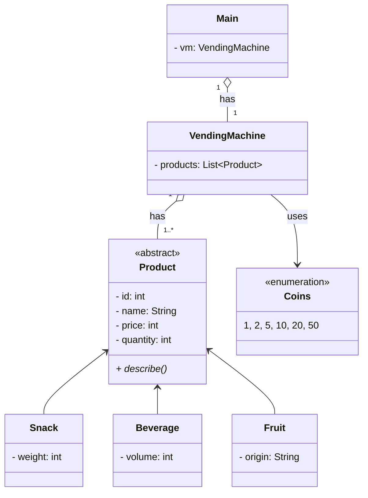

# Vending Machine Class Diagram

## Scenario

A vending machine stocks three categories of products: snacks, beverages, and fruits. Every product has a name, a
price, and a stock quantity. But each category also carries its own detail — a snack has a weight in grams, a beverage
has a volume in ml, and a fruit has a country of origin. When a product is displayed, it should describe itself
including that specific detail. The machine runs on coins. It accepts only the standard Swedish coin values: 1, 2, 5,
10, 20, and 50 kr. Any other value is rejected immediately and the balance does not change.

## Class Diagram

