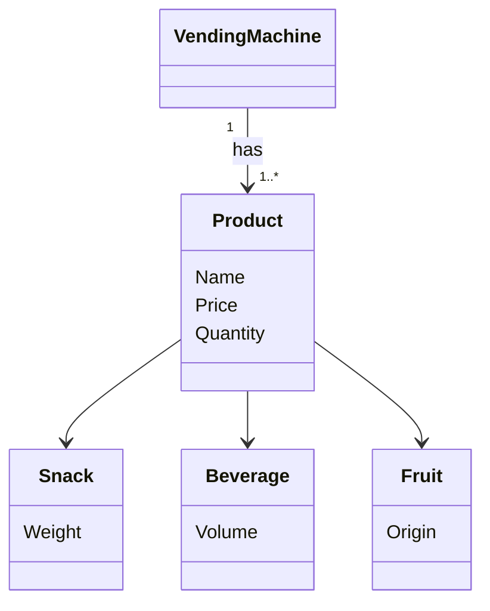

# Vending Machine Domain Model

## Scenario

A vending machine stocks three categories of products: snacks, beverages, and fruits. Every product has a name, a
price, and a stock quantity. But each category also carries its own detail — a snack has a weight in grams, a beverage
has a volume in ml, and a fruit has a country of origin. When a product is displayed, it should describe itself
including that specific detail. The machine runs on coins. It accepts only the standard Swedish coin values: 1, 2, 5,
10, 20, and 50 kr. Any other value is rejected immediately and the balance does not change.

## Extract Entities & Attributes

| Noun            | Type      | Comment                          |
|-----------------|-----------|----------------------------------|
| Vending Machine | Entity    | System, not a true Entity per se |
| Product         | Entity    | Abstract                         |
| Snack           | Entity    | Extends Product                  |
| Beverage        | Entity    | Extends Product                  |
| Fruit           | Entity    | Extends Product                  |
| Name            | Attribute | Product                          |
| Price           | Attribute | Product                          |
| Quantity        | Attribute | Product                          |
| Weight          | Attribute | Snack                            |
| Volume          | Attribute | Beverage                         |
| Origin          | Attribute | Fruit                            |
| Coin            | Category  | Enum                             |

## Draw Relationships & Multiplicity

